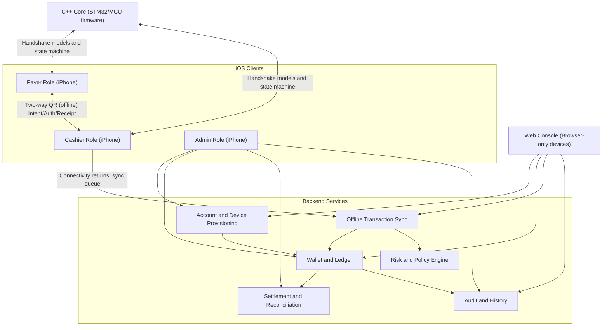

# offline-qr-wallet

Baseline implementation for a closed-loop wallet with IC-card-like top-up and offline debit using two-way QR exchange, with iOS clients, a browser web console, and an MCU-oriented C++ core for embedded integrations.

## Project Introduction (Graph)



## Repository Layout

- `backend/`: TypeScript REST backend for provisioning, top-up, offline transaction sync, reconciliation, and audit.
- `ios/OfflineQRWallet/`: Swift package with iOS client modules (key identity, two-way QR handshake, local journal, sync abstraction).
- `web/`: browser-based operations console for account/device/top-up/risk/transfer/sync operations.
- `cpp/stm32-wallet-core/`: portable C++ core for STM32/MCU integration of offline handshake and transaction states.
- `docs/`: high-level architecture notes.

## Quick Start

### 1) Backend

```bash
cd backend
npm install
npm run dev
```

Backend runs on `http://localhost:8080` by default.

### 2) iOS Client Module

Open `ios/OfflineQRWallet/Package.swift` in Xcode and integrate the `OfflineQRWallet` library into payer/cashier app targets.

### 3) Web Console

```bash
cd web
npm install
npm run dev
```

### 4) STM32 C++ Core

```bash
cd cpp/stm32-wallet-core
cmake -S . -B build
cmake --build build
ctest --test-dir build
```

### 5) Run Tests

```bash
cd backend
npm test

cd ../ios/OfflineQRWallet
swift test
```

## Implemented Capabilities (Initial Baseline)

- Account creation and role binding (`payer`, `cashier`, `admin`)
- Device registration and freeze flow
- Card transfer flow (`start` + `complete`) for moving wallet card authority to a new phone while revoking the old device
- Wallet top-up and balance query
- Offline transaction sync ingestion with idempotency handling
- Risk checks (per-transaction limit, daily spend limit, sync freshness, clock skew)
- Refund support
- Reconciliation summary endpoint
- Transaction history and audit log query
- Swift two-way QR handshake coordinator (`intent -> authorization -> receipt`)
- Local transaction persistence contracts and in-memory stores
- Async sync coordinator API for uploading pending offline transactions
- Swift backend API client for provisioning, top-up, refund, freeze, card transfer, balance, and offline sync
- Browser web console for backend operations on non-iOS deployment devices
- Embedded C++ handshake/state core for STM32-oriented firmware integration

## Current Scope Notes

- Storage is in-memory for fast prototyping; replace repository implementations with a persistent DB.
- Signature verification is a scaffold verifier; replace with real asymmetric signature verification before production.
- Swift crypto/key store currently has demo implementations and protocol boundaries for Secure Enclave + Keychain integration.

## App Icon Generation (ImageGen)

Use the bundled ImageGen script (requires `OPENAI_API_KEY`):

```bash
./scripts/generate_app_icon.sh
```

Generated icon path:

- `ios/OfflineQRWallet/Resources/AppIcon/offline-qr-wallet-icon.png`
